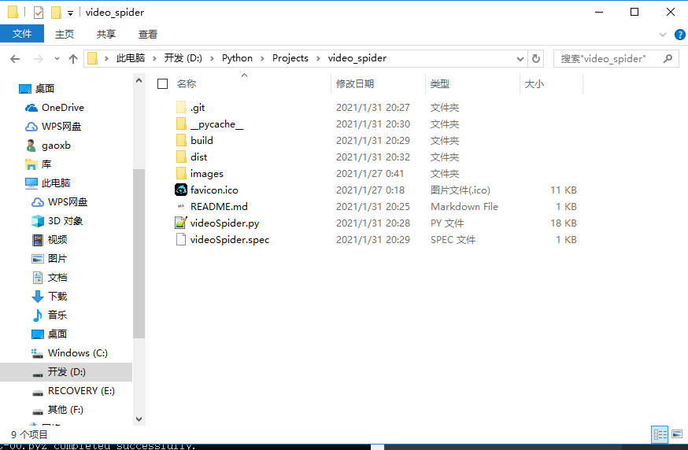
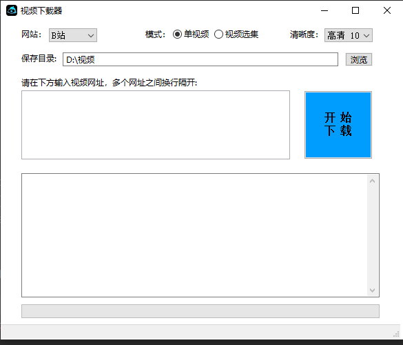
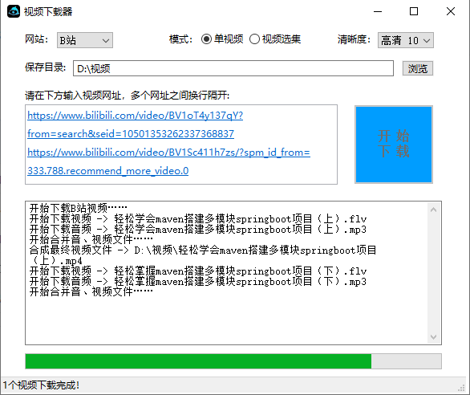
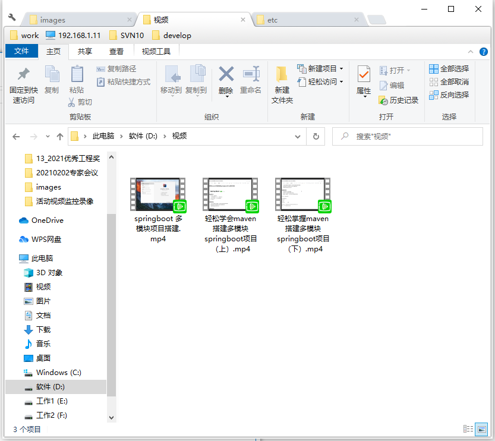

# video_spider
> Python编写的视频爬虫桌面GUI程序，可以将代码导入开发工具运行，也可以双击dist/videoSpider目录中的videoSpider.exe直接运行。

### 将项目打包成exe文件
1. 安装pyinstaller

```shell script
# 如果安装失败，用管理员权限安装
pip install pyinstaller 
```

2. 打包程序
       2.1 将ico图片、和代码同一文件夹
       2.2 Win+R，cmd进入管理员界面 cd切换到代码目录
   	2.3 输入打包命令

   ```shell
   pyinstaller -w --icon=favicon.ico videoSpider.py
   ```

   ​        -F 表示打包(F 大写)
   ​        -w 取消控制台显示(w 小写)
   ​        -i 有错误也继续执行(i 小写)
   ​        ico图片路径（绝对路径）
   ​        最后是代码名称
   ​    2.4 如果程序里面有图片，需要将图片复制到exe文件同一级文件夹，否则程序无法正常运行
   ​    注意：
   ​    	文件路径千万不要有中文，否则会出现一些编码方面的错误。

3. 打包那个文件结构如下：

   

   如果打包报错，参考如下文章：

   [Pyinstaller将python代码打包成exe | Pyinstaller错误合计]: https://blog.csdn.net/summer_dew/article/details/86535311

4. 最终运行效果如下：






